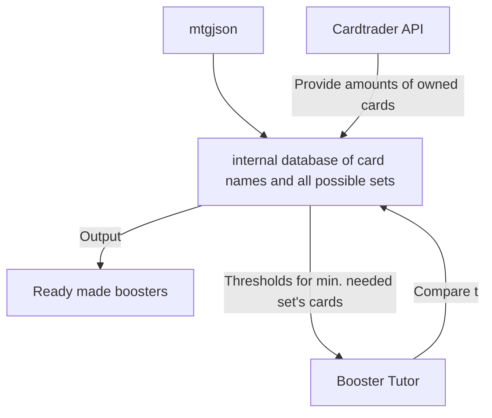

# Draftbooster Generator

An app that pulls cards on sale info from cardtrader API to generate random MTG boosters for Chaosdraft.

## Working principle

```mermaid
flowchart TD
C[mtgjson]-->B[internal database of card names and all possible sets]
A[Cardtrader API]--Provide amounts of owned cards-->B
B--Thresholds for min. needed set's cards-->D[Booster Tutor]
D--Compare to-->B
B--Output-->E[Ready made boosters]
```
