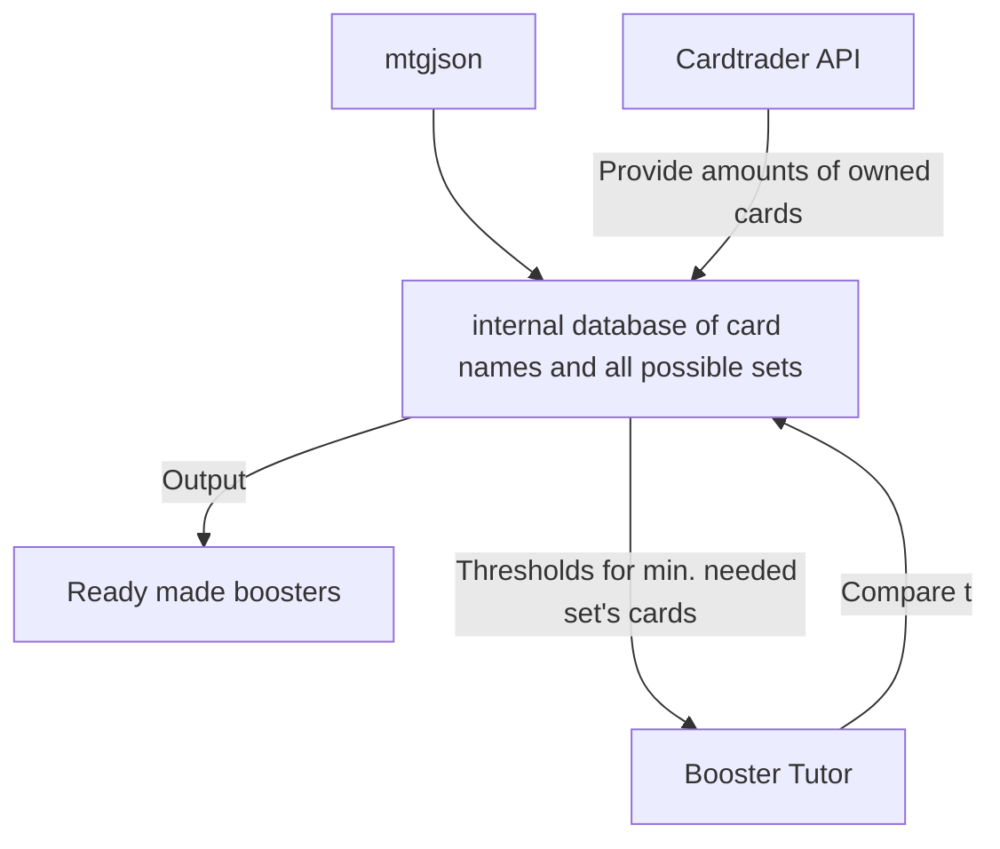

# Requirement Specifications

## Working principle

## Modules

### Cardtrader API-service
- pulls a sellers list from Cardtrader's API
- pulls list of cardname and amount

### mtgjson service
- pulls a list of all cards, and what sets they appear in
- in this info a card id is the same if it has the same name

### amount decider algorithm/module
- decides which sets are favorable to try to generate boosters for
- looks at cards available in different rarities
- probably needs some trying out

### booster tutor
- when the algorithm has decided which sets you should try to generate boosters for, send the list of sets to booster tutor
- booster tutor generates some random boosters until it is ok for pack collation (step 1)
- boosters from step 1 are compared to database of owned/available cards (step 2)
- if there's enough, output a booster and remove it from the available cards (step 3)

### output module
- can be just terminal text format for starters
